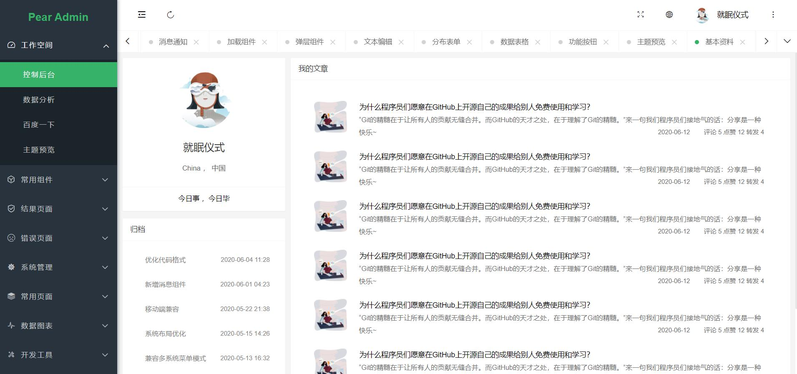

 
 

  <h1 align="center">
    Pear Admin Layui
  </h1>
  <h4 align="center">
    开 箱 即 用 的 前 后 端 解 决 方 案
  </h4> 

  [预 览](http://layui.pearadmin.com)   |   [官 网](http://www.pearadmin.com/)   |   [群聊](https://jq.qq.com/?_wv=1027&k=5OdSmve)   |   [社区](http://forum.pearadmin.com/)|   [文档](http://www.pearadmin.com/doc)

    
    
      

 

  

 

#### 项目介绍

基于Layui的后台管理系统模板，扩展Layui原生UI样式，整合第三方开源组件，提供便捷快速的开发方式，延续LayuiAdmin

的设计风格，持续完善的样式与组件的维护，基于异步Ajax的菜单构建，相对完善的多标签页，单标签页的共存，为使用者提

供相对完善的开发方案，只为成为更好的轮子，项目不定时更新，建议 Star watch 一份

#### 开源地址

Gitee 开源地址 : https://gitee.com/pear-admin/Pear-Admin-Layui

GitHub 开源地址 ：https://github.com/PearAdmin/pear-admin-layui

#### 开源共建

1. 欢迎提交 [pull request](https://gitee.com/pear-admin/Pear-Admin-Layui/pulls)，注意对应提交对应 `master` 分支

2. 欢迎提交 [issue](https://gitee.com/pear-admin/Pear-Admin-Layui/issues)，请写清楚遇到问题的原因、开发环境、复显步骤。

#### 预览项目

|  |  |
|---------------------|---------------------|
|   |   |
||    |
| |   |
| |     |
| |    |
||    |
||    |
||    |
