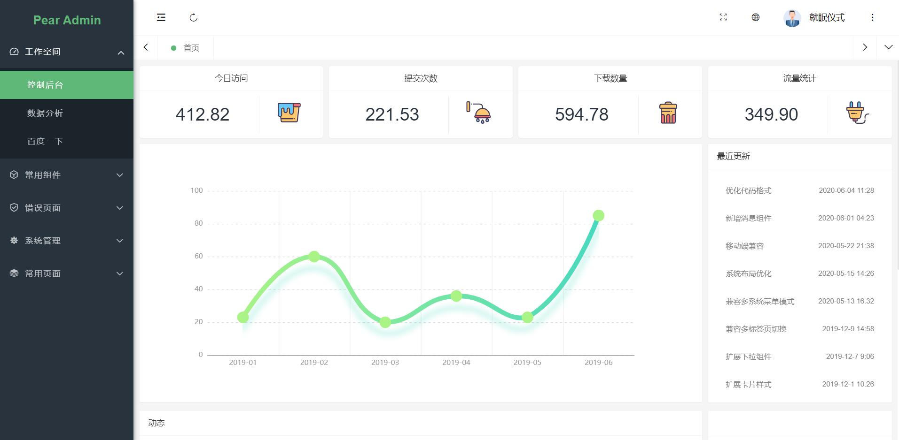
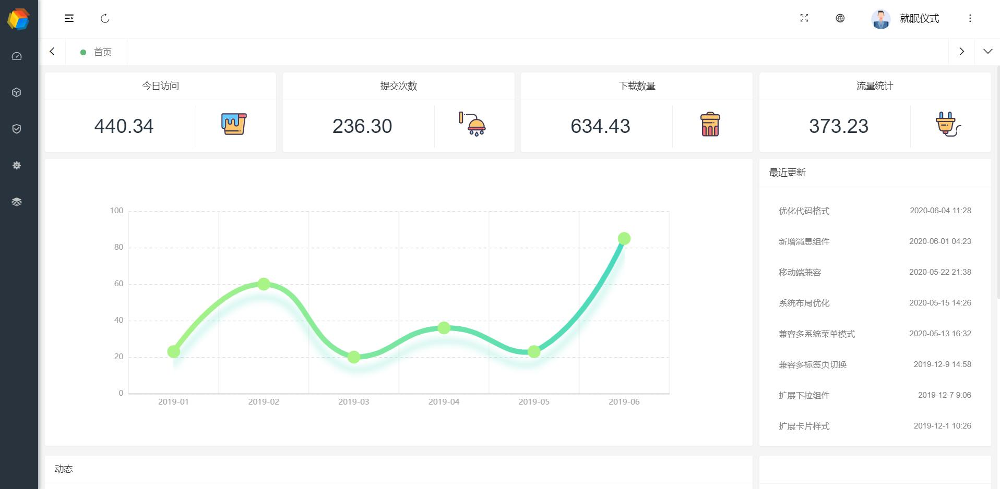
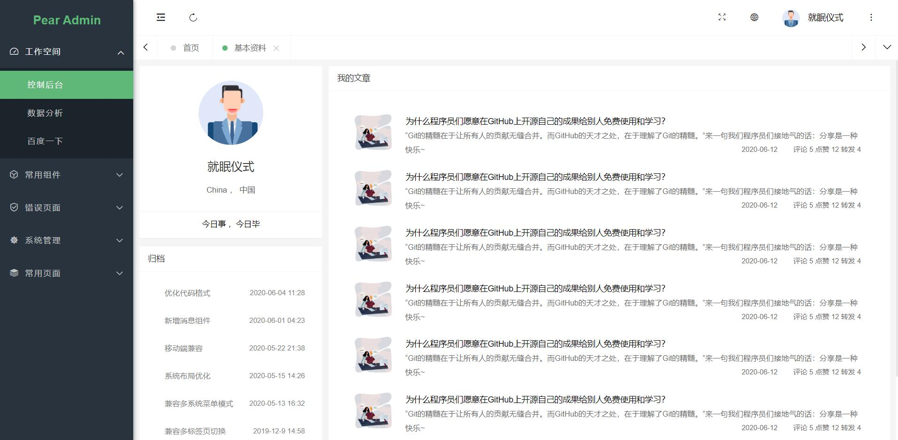
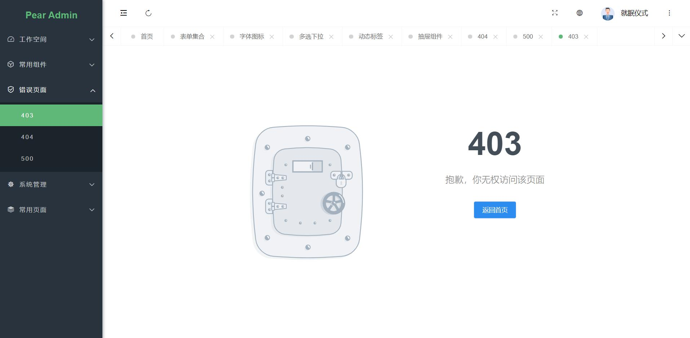
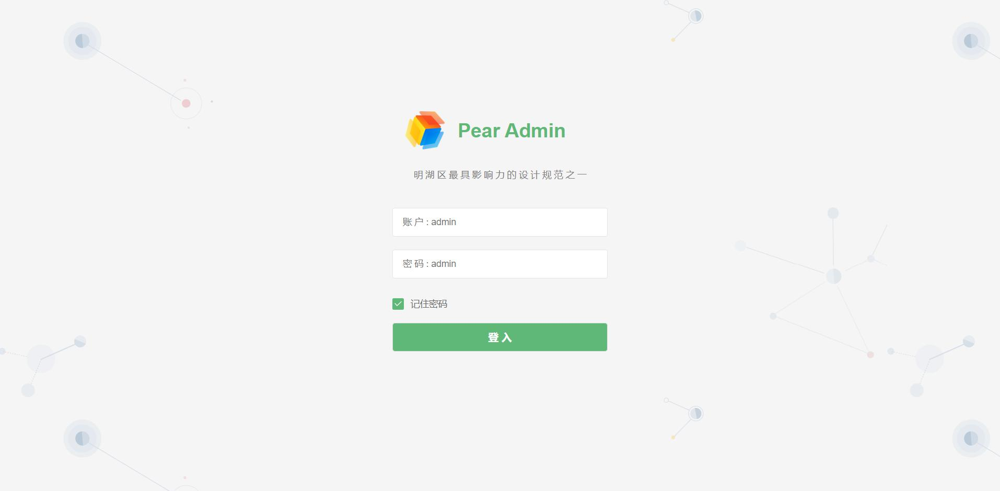
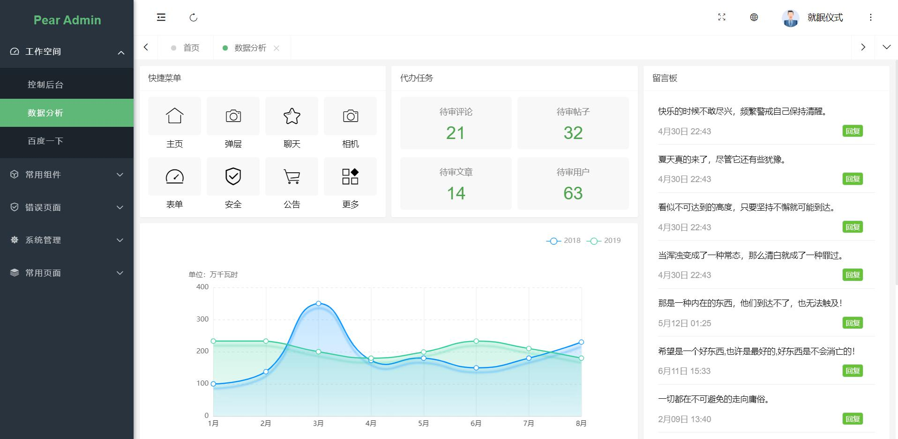
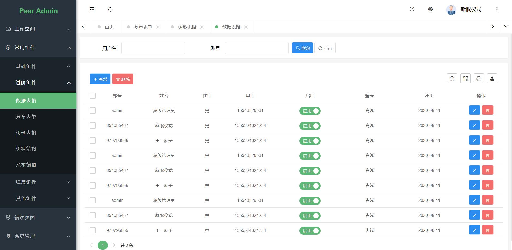
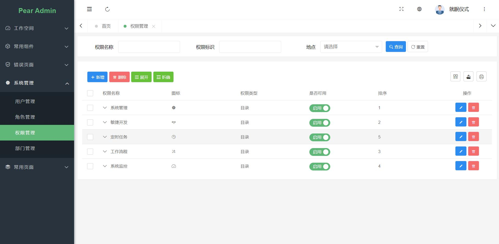

 
 

  <h1 align="center">
    Pear Admin Layui
  </h1>
  <h4 align="center">
    开 箱 即 用 的 前 后 端 解 决 方 案
  </h4> 

  [预 览](http://layui.pearadmin.com)   |   [官 网](http://www.pearadmin.com/)   |   [群聊](https://jq.qq.com/?_wv=1027&k=5OdSmve)   |   [社区](http://forum.pearadmin.com/)

    
    
      

 

  

 

#### 项目介绍

基于Layui的后台管理系统模板，扩展Layui原生UI样式，整合第三方开源组件，提供便捷快速的开发方式，延续LayuiAdmin

的设计风格，持续完善的样式与组件的维护，基于异步Ajax的菜单构建，相对完善的多标签页，单标签页的共存，为使用者提

供相对完善的开发方案，只为成为更好的轮子，项目不定时更新，建议 Star watch 一份

如果你需要无组件整合 与 示例页面 的基础框架，请前往 [Pear Admin Layui 基础版本](https://gitee.com/Jmysy/Pear-Admin-Layui/tree/pear-admin-template)

#### 开源地址

Gitee 开源地址 : https://gitee.com/Jmysy/Pear-Admin-Layui

GitHub 开源地址 ：https://github.com/Jmysy/Pear-Admin-Layui

QQ 群: 682110771

#### 开源共建

1. 欢迎提交 [pull request](https://gitee.com/Jmysy/Pear-Admin-Layui/pulls)，注意对应提交对应 `master` 分支

2. 欢迎提交 [issue](https://gitee.com/Jmysy/Pear-Admin-Layui/issues)，请写清楚遇到问题的原因、开发环境、复显步骤。

#### 项目演示

### 开源推荐

后台管理系统  [pear admin boot](https://gitee.com/Jmysy/Pear-Admin-Boot)

后台管理系统：[springboot v2](http://gitee.com/bdj/SpringBoot_v2)

积木组件库: [api boot](https://apiboot.minbox.io)

顺序消息管道 [message pipe](https://gitee.com/minbox-projects/message-pipe)

本框架为开源框架，Apache 开源协议，支持商用，学习

